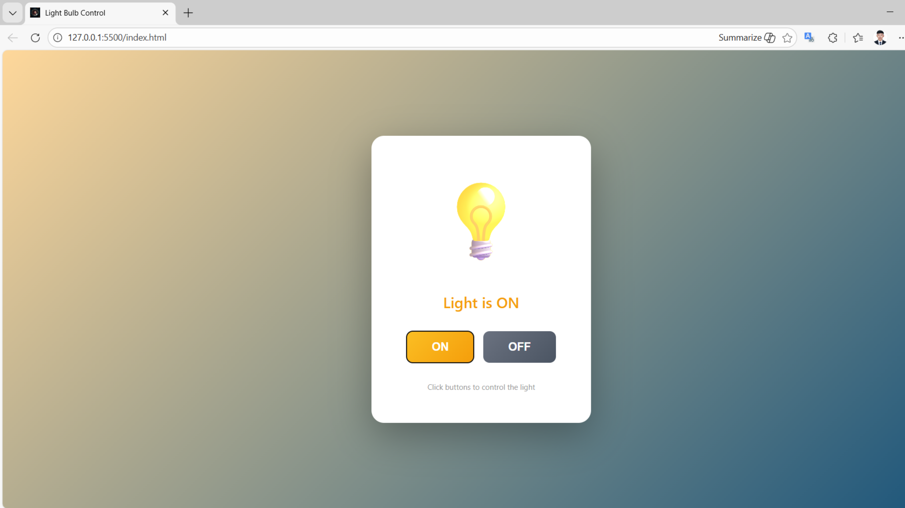

​

````md
# 💡 Light Bulb Control – jQuery DOM Project

A clean and interactive front-end project that demonstrates how to control a **light bulb ON and OFF** using **jQuery DOM manipulation**.  
This project focuses on practicing UI interactions, DOM events, and writing clean, well-structured front-end code with basic web technologies.

🌐 **Portfolio**  
👉 https://pichchanthorn.github.io/pich-chanthorn-portfolio/

---

## 📌 Project Overview

The **Light Bulb Control** project is a simple yet practical web application that allows users to control the state of a light bulb using **ON** and **OFF** buttons.

This project was built as a learning exercise to improve my understanding of:

- jQuery DOM manipulation  
- Event handling  
- UI state management  
- Professional front-end project structure  

---

## 📸 Project Preview

Below are screenshots showing both states of the application.

<table>
  <tr>
    <th align="center">🔆 Light ON</th>
    <th align="center">🌑 Light OFF</th>
  </tr>
  <tr>
    <td align="center">
      
    </td>
    <td align="center">
      
    </td>
  </tr>
</table>

---

## ✨ Features

- Light bulb ON / OFF control  
- Visual glow animation when the light is ON  
- Dynamic background color changes  
- Clear ON / OFF status indicator  
- Clean, minimal, and responsive user interface  
- Beginner-friendly and easy-to-read code  

---

## 🧠 What I Learned

Through this project, I learned how to:

- Select and manipulate DOM elements using jQuery  
- Handle user interactions with `.click()` events  
- Manage UI states using CSS classes  
- Separate HTML, CSS, and JavaScript for better maintainability  
- Organize a front-end project suitable for GitHub and portfolios  

---

## 🛠 Technologies Used

- **HTML5** – Page structure and content  
- **CSS3** – Styling, layout, and animations  
- **jQuery** – DOM manipulation and event handling  
- **Git & GitHub** – Version control and project hosting  

---

## 📂 Project Structure

```text
light-bulb-control/
│
├── index.html          # Main HTML file
├── README.md           # Project documentation
│
├── css/
│   └── style.css       # Styles and animations
│
├── js/
│   └── script.js       # jQuery logic
│
└── assets/
    ├── on.png          # Light bulb ON screenshot
    └── off.png         # Light bulb OFF screenshot
````

---

## ▶️ How to Run the Project

1. Clone this repository:

   ```bash
   git clone https://github.com/pichchanthorn/light-bulb-control.git
   ```

2. Open the project folder

3. Open `index.html` in a modern web browser

4. Click **ON** or **OFF** to control the light bulb

*No additional installation is required.*

---

## 🎯 Use Cases

* Beginner practice project for jQuery & DOM
* UI interaction demo
* Portfolio project
* Reference for simple ON / OFF logic
* Teaching example for front-end basics

---

## 👨‍💻 Author

**Pich Chanthorn**
Information Technology Student
Build Bright University

🌐 Portfolio: [https://pichchanthorn.github.io/pich-chanthorn-portfolio/](https://pichchanthorn.github.io/pich-chanthorn-portfolio/)
🐙 GitHub: [https://github.com/pichchanthorn](https://github.com/pichchanthorn)

---

## 📄 License

This project is licensed under the **MIT License**.
You are free to use, modify, and share this project for learning and personal purposes.

````

​